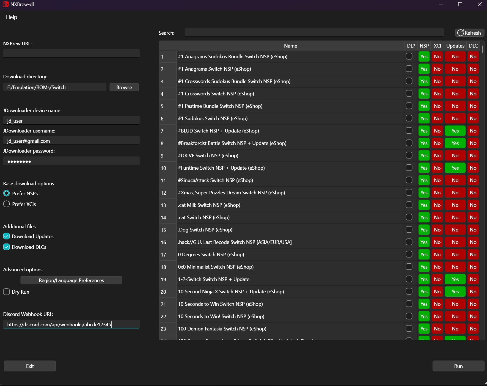

#####
Usage
#####

NXBrew-dl is designed to be simple to use. After loading (and entering a URL for NXBrew, which we **will** not provide),
you will see an interface like this:

On the left is the config. This includes where downloads will be stored, whether you would like to prefer NSP or XCI
files, and whether you would like to download associated updates and DLC, if available.

The right shows the NXBrew index. Each is flagged with various properties, such as whether it has an NSP or XCI file,
updates, and DLC. By clicking the "DL?" button, you add to the list. You can filter using the search bar at the top.
By clicking run, you will queue up downloads.
